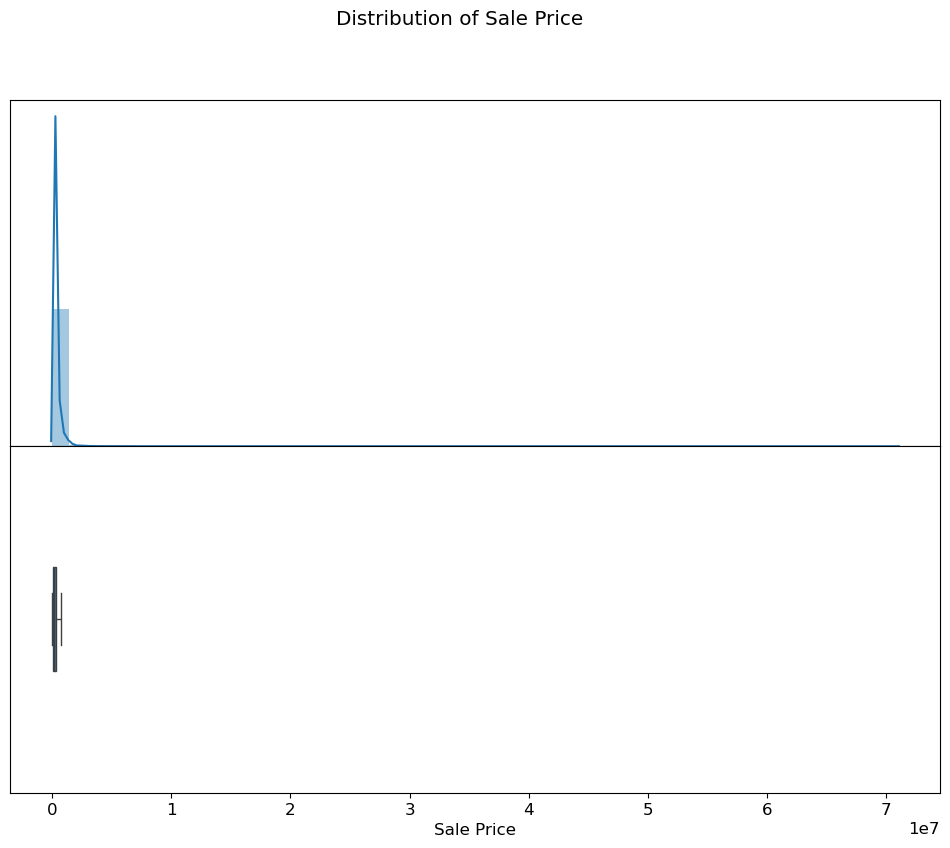
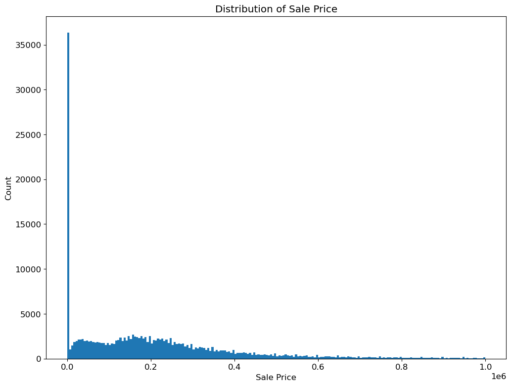
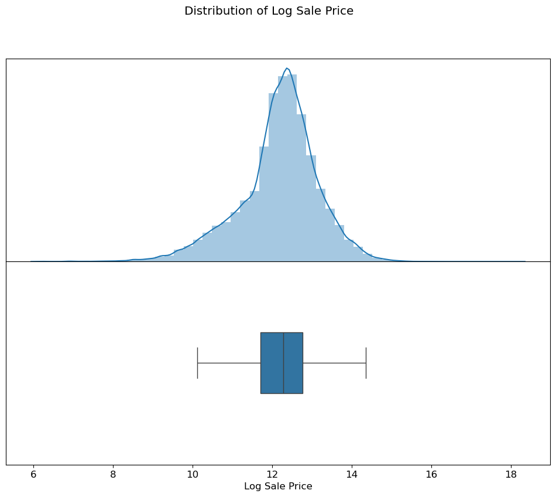
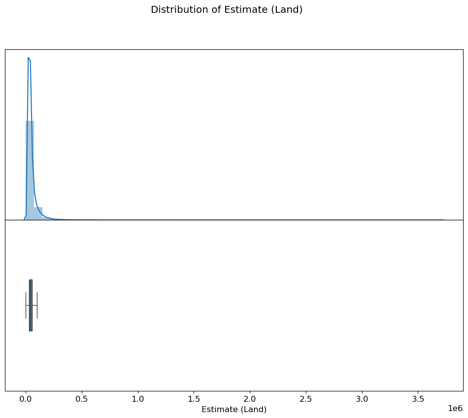
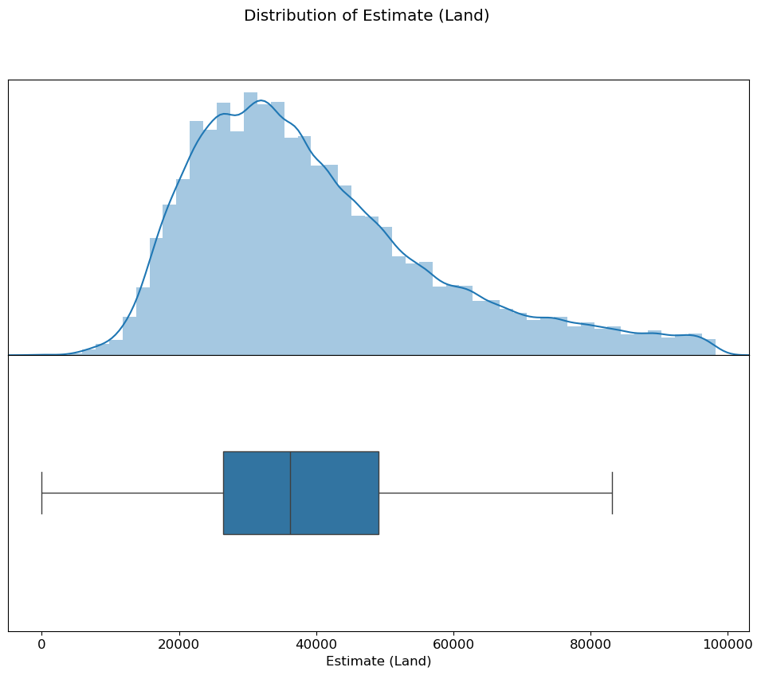
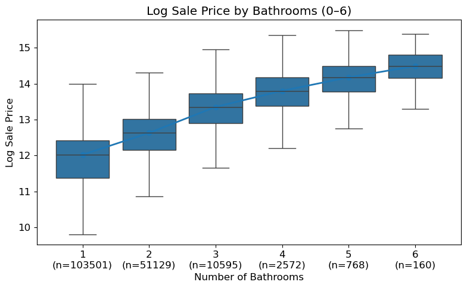
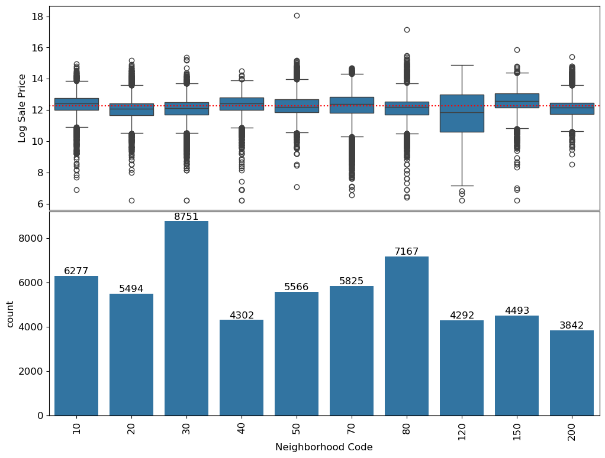
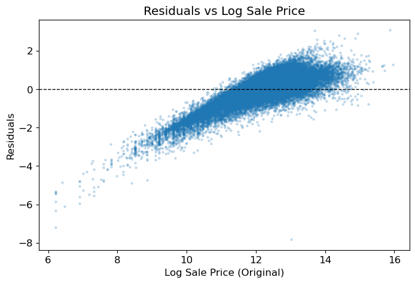
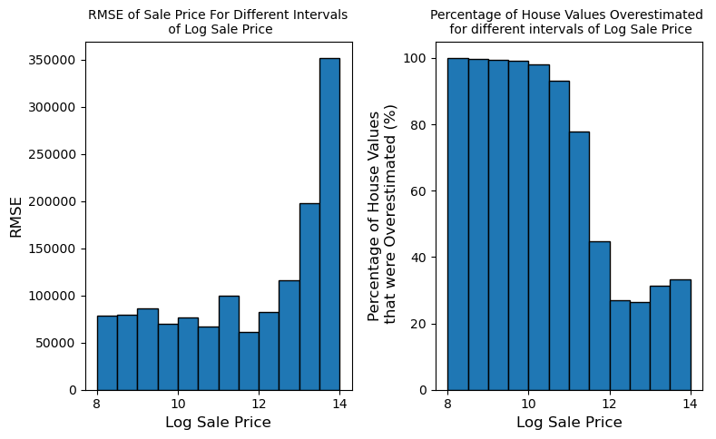
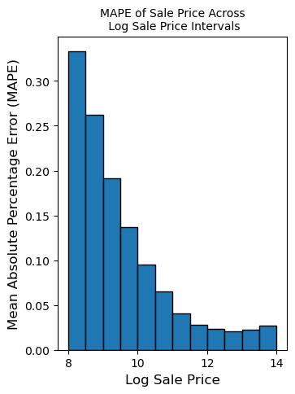

# Original Coding Process and Analysis

This document preserves the reasoning path from the original notebooks in a recruiter-friendly format. The rendered web version is `docs/process.html`; the original academic artifacts remain in `projA1.ipynb`, `projA2.ipynb`, `projA1.pdf`, and `projA2.pdf`.

## 1. Human Context

The project asks whether a property assessment model can be accurate without shifting tax burden unfairly. Each row represents a Cook County residential property record with sale information, structural attributes, location-related fields, and prior assessment estimates.

My fairness framing:

- Overassessment can increase a homeowner's tax bill.
- Underassessment of expensive homes can shift tax burden to other property owners.
- A model can have good average RMSE while still being regressive.
- A fair model should have residuals centered near zero across price tiers and communities.

## 2. Exploratory Data Analysis

The first notebook inspected data quality, skew, and candidate predictors.

Important findings:

- Sale price was highly right-skewed.
- Very low sale prices, including records below `$500`, looked unlike normal market transactions.
- Log transforms made sale price and building square footage more suitable for linear modeling.
- Assessment estimates and land values also had skew and outliers.

```python
training_data = initial_data[initial_data["Sale Price"] >= 500]
training_data["Log Sale Price"] = np.log(training_data["Sale Price"])
training_data["Log Building Square Feet"] = np.log(training_data["Building Square Feet"])
```







## 3. Outlier Handling

The original notebook used an IQR-style outlier workflow for skewed numeric variables. This made distributions more legible for EDA and helped prevent extreme values from controlling the visual story.





## 4. Feature Engineering

The notebooks explored multiple feature families:

| Feature area | Original analysis | Reasoning |
|---|---|---|
| Sale price | Converted to `Log Sale Price` | Reduced skew and improved linear modeling behavior |
| Building size | Used `Log Building Square Feet` | Larger homes generally sell for more; log scale improved linearity |
| Bathrooms | Extracted from bath fields or `Description` text | Interpretable home quality signal |
| Assessment estimates | Used `Log Estimate (Building)` | Strong valuation signal available at prediction time |
| Neighborhood | Explored top neighborhoods and expensive-neighborhood indicators | Location matters, but uneven group sizes require care |
| Categorical attributes | Explored substitution and one-hot encoding | Useful but kept out of the compact final demo model |

The final portfolio model keeps a compact, explainable feature set:

```text
Log Estimate (Building)
Bathrooms
Log Building Square Feet
```





## 5. Modeling and Validation

The second notebook fits ordinary least squares linear regression on `Log Sale Price` using `sklearn.linear_model.LinearRegression(fit_intercept=True)`.

Pipeline rules:

- Copy the input dataframe instead of mutating it.
- Create `Log Sale Price` only for training data.
- Apply sale-price outlier filtering only during training.
- Do not remove test rows, because a real assessment system must value every property.
- Fill missing feature values with medians.

Original notebook validation results:

```text
Train RMSE:     0.6002
Holdout RMSE:   0.5937
4-fold CV RMSE: 0.6002 +/- 0.0049
```

The close train, holdout, and cross-validation scores suggest the model was not simply memorizing the training data. Because the target is log sale price, the error is best interpreted as multiplicative rather than a fixed dollar miss.



## 6. Fairness Analysis

The key fairness question was whether residuals implied regressive assessment: lower-priced homes overvalued and higher-priced homes undervalued.

Original notebook findings:

```text
RMSE for lower-priced homes:  about $76,899
RMSE for higher-priced homes: about $245,632

Lower-priced homes overestimated: 57.78%
Higher-priced homes overestimated: 27.69%
```

The dollar RMSE is larger for expensive homes, but the overestimation pattern is the fairness signal. Lower-priced homes were more likely to be predicted above actual value, while higher-priced homes were less likely to be overestimated.



## 7. Metric Reflection

RMSE is useful, but it can hide proportional harm because large dollar errors on expensive homes dominate the metric. The notebook explored MAPE as a relative-error alternative.

```python
def mape(theta, X, y):
    y_pred = X @ theta
    percentage_error = np.abs((y - y_pred) / y)
    return np.mean(percentage_error)
```



My conclusion: a responsible assessment workflow should report aggregate accuracy, proportional error, residual parity, and over/under-assessment rates by meaningful groups.

## 8. Refactor for Recruiters

The portfolio refactor adds:

- reusable Python modules for feature engineering and diagnostics;
- a command-line training script;
- a smoke test that runs without the original course data;
- a live results page;
- this fuller process page with original notebook visualizations.

The strongest story is not just that I trained a model. It is that I trained a model, validated it, and audited whether its errors could create unfair tax outcomes.
